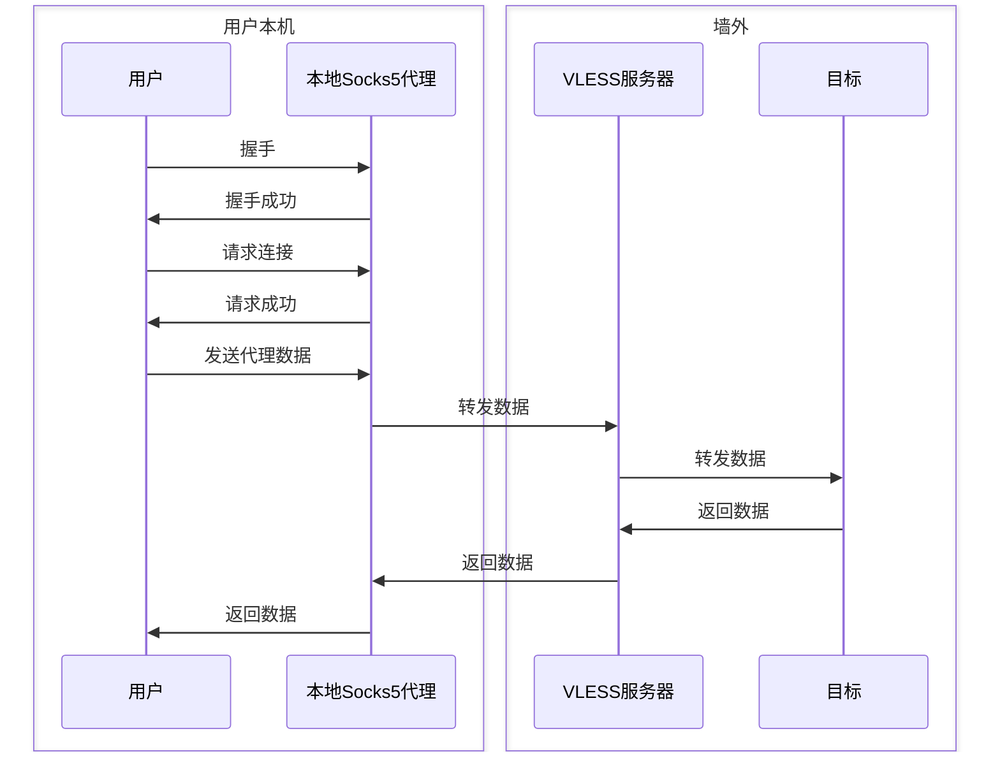

# VLESS+Websocket+TLS的Python简单实现

- Author: Safewoo
- Date: 2025-01-21

## 随便说说

先上地址 http://github.com/safewoo/xypro

最近研究了下各个代理协议，先说结论： **只有伪装成HTTP的协议才是王道** 这里说的`HTTP`指的是各种基于HTTP+TLS的传输方式，包括`HTTP/2`、`Websocket`、`Quic` 等。在TLS中，进一步的加密方式没有必要， 围绕着TLS和HTTP协议本身进一步配置安全措施就足够了。进一步说，TLS+通用协议才是王道，例如伪装成 Rsync+TLS, Kafka+TLS 这种大流量的协议，也许以后可以在[xypro](http://github.com/safewoo/xypro)中添加相关实现。

基于以上结论，我认为VLESS是个不错的选择。 首先它并不加密，完全由TLS处理加密，这减少了计算的消耗；其次它是无状态的，无需握手等操作，这减少了延迟。也不需要维持连接。

传输方式的选择上，暂时实现了Websocket，但是我认为websocket**不是一个理想的选择**，Websocket会将流量切片分成一个个Frame，对于代理协议的传输完全没有必要而且浪费资源，增加延迟。伪装成Websocket的代理，有被识别的风险，因为它的握手、切片等特征会让GFW能够确定这是一个Websocket链接，没有什么正经应用会用Websocket传输大量流量。如果使用HTTP/2会看起来更加合理，看起来有可能是在传输视频流。

## 常用的代理协议实现方式

无论是最早的Shadowsocks，还是后来的V2Ray，Clash，Gost系列，都需要在用户本地启动一个Socks5代理，再把流量加密发送的真正的代理服务器上。期间甚至要通过链式转发，经过多层代理才能把流量发送到真正的目标，这也是无奈之举，和墙的斗争是永无止境的。

我们的简化版只有一层转发，流程如下：





## Socks5的实现

所以我们需要实现一个Socks5的inbound来接收流量。通过[RFC1928](https://datatracker.ietf.org/doc/html/rfc1928) 我们初步梳理下Socks5的流程。我们暂时不实现Socks5认证相关的部分。
python的`asyncio`让我们能够很轻松的编写异步网络程序。

实现`asyncio`的`Protocol`接口，在`data_received`中实现Socks5的主要流程。在`_hanshake` `_connect` `_reply` `_recv_request` `_udp_associate`中实现Socks5的各个步骤。具体代码请参照[xypro](http://github.com/safewoo/xypro)

```python

class Socks5InboundProtocol(asyncio.Protocol):

    _handshaked = False
    version: int | None = None
    command: int | None = None

    def _hanshake(self, data:bytes):
        ...

    def _connect(self):
        ...

    def _reply(self):
        ...

    def _recv_request(self, data:bytes):
        ...

    def _udp_associate(self)
        ...

    def data_received(self, data: bytes):
        if not self.version:
            self._handshake(data)
            return
        if self.command is None:
            self._recv_request(data)
            match self.command:
                case Socks5Msg.CMD_CONNECT:
                    self._connect()
                case Socks5Msg.CMD_UDP:
                    self._udp_associate()
                case _:
                    raise NotImplementedError
            return

    def connection_made(self, transport):
        ...

    def connection_lost(self,exc):
        ...

```

使用`loop.create_server`创建一个TCP服务器

```python
loop = asyncio.get_event_loop()
inbound = await loop.create_server(
    lambda: Socks5InboundProtocol(config=config, loop=loop), 
    host=host, port=port
)
```
Socks5的TCP转发非常简单，不用任何特殊处理，直接发送到目标服务器。

Socks5的`UDP Associate`需要在`请求连接`中判断是否是UDP请求。如果是，创建一个UDP服务器绑定到一个随机端口，将绑定地址返回给客户端。客户端发送UDP数据包到这个端口，服务器再转发到目标。

## VLESS的实现

VLESS并没有详细文档，在Xray的文档中有[一些介绍](https://xtls.github.io/development/protocols/vless.html)。并且在介绍中没有提到`Flow`的详细信息，同时也没有说明UDP的实现。xypro只实现UDP的部分，`Flow`的部分暂时未实现。

由于VLESS是一个无状态的协议，对它的处理只需要简单的函数。

#### 出栈处理

对于Socks5转发而来的TCP数据流，直接加上VLESS的头部，然后发送到目标服务器。如果是UDP数据，需要计算UDP数据帧的长度，然后加上VLESS的头部。

```python
def outbound_process(
    self, data: bytes, udp=False, dst: AtypAddress | None = None
) -> bytes:
    "Handle the outgoing stream, wrap a vless head if not sent"

    if self.head_sent:
        return data

    if not self.context.destination:
        raise ValueError("Missing destination")

    if udp:
        if not dst:
            raise ValueError("UDP outbound requires `dst`")
        cmd = VlessCommand.UDP
        payload_len = len(data)
        data = struct.pack("!H", payload_len) + data
    else:
        cmd = VlessCommand.TCP
        dst = self.context.destination

    atyp, addr, port = dst

    head = VlessRequest(
        ver=VLESS_VER,
        uuid=self.context.config.uuid,
        ext_len=0,
        ext=b"",
        cmd=cmd,
        port=port,
        atyp=atyp,
        addr=addr,
    ).pack_head()

    data = head + data
    self.head_sent = True
    return data
```

#### 入栈处理

入栈处理非常简单，只需要解析VLESS的头部，然后将数据发送到Socks5的客户端。

## Websocket传输

使用Websocket作为传输层，可以让我们的流量看起来更像是正常的HTTP流量。尤其是我们可以在v2ray服务器前面使用Nginx进行流量转发。同时对Nginx做如下配置

- 使用CA签发的TLS证书，不要使用自签名证书。自签名证书等于没有证书，代理流经的任何设备都可以对你做中间人攻击。
- 配置一个随机的HTTP路径或HTTP头，对于路径以外的任何请求返回404或403，这样可以防止嗅探。


参考 https://datatracker.ietf.org/doc/html/rfc6455

```Mermaid
sequenceDiagram
    participant 客户端
    participant Websocket
    participant VLESS服务器

    客户端->>Websocket: Websocket握手
    Websocket->>客户端: 协议更新至Websocket
    客户端->>Websocket: 发送数据帧
    Websocket->>VLESS服务器: 发送帧payload
    VLESS服务器->>Websocket: 将代理结果组装成Websocket帧
    Websocket->>客户端: 发送数据帧
    VLESS服务器->>Websocket: 将代理结果组装成Websocket帧
    Websocket->>客户端: 发送数据帧
    VLESS服务器->>Websocket: 将代理结果组装成Websocket帧
    Websocket->>客户端: 发送数据帧
    客户端->>Websocket: 发送关闭帧
    Websocket->>客户端: 关闭连接
```

我们同样需要实现一个 `asyncio.Protocol`, 在`data_received`中实现Websocket的握手和数据帧的解析。

```python
class WebsocketOutboundProtocol(Protocol):

    _buffer: asyncio.StreamReader

    def _handshake(self):
        ...

    def _upgrade(self):
        ...

    def _create_frame(self):
        pass

    async def _parese_frame(self):
        "read a frame from the buffer."
        ...

    def _create_frame(self, payload: bytes, opcode=OPCODE_BINARY, fin=1) -> bytes:
        ...

    def connection_made(self, transport):
        self.transport = transport
        self._handshake()
        ensure_future(self._process_buffer())

    async def _process_buffer(self):
        while self._closed is False:
            _fin, opcode, payload = await self._parse_frame()
            if opcode == OPCODE_BINARY:
                # VLESS只支持二进制数据
                ...
            elif opcode == OPCODE_TEXT:
                # 不会收到TEXT帧
                raise NotImplementedError
            elif opcode == OPCODE_CLOSE:
                # 关闭连接
                ...
            elif opcode == OPCODE_PING:
                self.write(b"", opcode=OPCODE_PONG)
            else:
                ...
        logger.debug("Process buffer finished")

    def connection_made(self, transport: WriteTransport):
        self.transport = transport
        self._handshake()
        ensure_future(self._process_buffer())

    def data_received(self, data: bytes):
        if not self.handshaked:
            self._upgrade(data)
            return
        self._buffer.feed_data(data)
    
```

在使用 `loop.create_connection`创建连接指定`ssl=ssl.create_default_context()`即可

## 结尾

以上是一个简单的VLESS+Websocket+TLS的实现，仅供学习参考。实际使用中还需要考虑更多的细节，xypro也仅作为学习之作，不适合在生产环墋中使用。